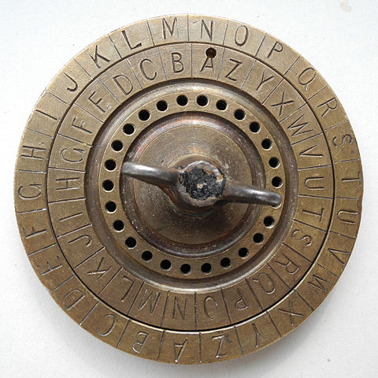

# caesar



Go implementation of the famous basic substitution cipher named after [Julius Caesar](https://en.wikipedia.org/wiki/Caesar_cipher).

[](https://godoc.org/github.com/kevinschoon/caesar)

## Installation


```bash
go get github.com/kevinschoon/caesar
```

## Usage

```go
import (
    "fmt"

    "github.com/kevinschhoon/caesar"
)


func main() {
	// create a cipher with the default character set
	// and letters shifted 10 characters forward.
	cipher := caesar.NewCaesarCipher(10, caesar.DefaultCharacterSet)
	cipherText := cipher.MustEncode("Hello World!")
	fmt.Println(cipherText) // Rovvy*gy!vn+
	decodedText := cipher.MustDecode(cipherText)
	fmt.Println(decodedText) // Hello World!
}
```

## Supported Characters

The library only supports a limited subset of ASCII characters but you are free to provide
your own CharacterSet of runes.

```go

var (
        // DefaultCharacterSet contains a default table of
        // supported characters.
        DefaultCharacterSet = []rune{
                ' ', '!', '"', '#',
                '$', '%', '&', '\'',
                '(', ')', '*', '+',
                ',', '-', '.', '/',
                '[', '\\', ']', '^',
                '_', '`', '{', '|',
                '}', '~',
                '0', '1', '2', '3',
                '4', '5', '6', '7',
                '8', '9', ':', ';',
                '<', '=', '>', '?',
                '@', 'A', 'B', 'C',
                'D', 'E', 'F', 'G',
                'H', 'I', 'J', 'K',
                'L', 'M', 'N', 'O',
                'P', 'Q', 'R', 'S',
                'T', 'U', 'V', 'W',
                'X', 'Y', 'Z', 'a',
                'b', 'c', 'd', 'e',
                'f', 'g', 'h', 'i',
                'j', 'k', 'l', 'm',
                'n', 'o', 'p', 'q',
                'r', 's', 't', 'u',
                'v', 'w', 'x', 'y',
                'z',
        }
)
```

